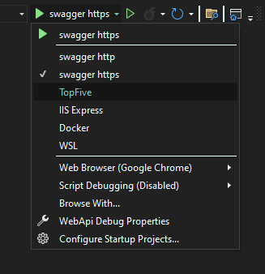

# SHORTURL

## Especificações do projeto

Projeto para encurtador de URL em .Net 7.

O projeto consiste em uma Web Api composto de 5 endpoints para o encurtamento de urls. O usuário irá adicionar uma url através do endpoint `/url/create` que irá rtornar uma url curta que poderá ser usada para retornar à url original.

O endpoint `/{id}` é usado para testar a url curta, sendo que o usuário também poderá usá-la diretamente no browser, pois ela irá abrir uma nova aba para a url original desde que a api esteja rodando.

O endpoint `/url/getAll` retorna uma lista com todas as urls inseridas pelos usuários bem como sua url curta e outras informações ordenada pela ordem de adição, já o endpoint `/url/topFive` retorna as 5 url´s curtas que tiveram mais cliques.

O endpoint `/url/validate` é usado para validar se a url curta está retornando uma url original válida, ou seja, que aponte para um site na web. Qualquer outro tipo de problema relacioando à url original será reportado para o usuário com uma mensagem de retorno de erro.

### Top 5

Para o aplicativo retornar o json com o top 5 basta escolher o profile 'TopFive' conforme imagem abaixo:

### Arquitetura

A arquitetura utilizada foi a Clean Architecture, e alguns dos design patterns utlizados foram:
* Repository
* CQRS
* Minimal API
* Outbox
* Unit Of Work

Os patterns Repository, CQRS e Minimal API foram utilizados por serem de simples implementação e que ao mesmo tempo trazem uma boa organização ao projeto. Vale destacar que, embora o projeto utilize apenas 1 banco de dados, mesmo assim se justifica o uso do CQRS pelos benefícios já citados.

Já o uso do Outbox pattern foi interessante porque ele trás uma camada a mais de consistência ao projeto, visto que, ao gravar as mensagens no banco de dados juntamente com o evento que dispara estas mensagens, no caso a criação da url curta, antes de enviar para o message broker, garantimos a atomicidade da operação uma vez que o Unit Of Work garante que se houver algum erro na gravação da url ou da mensagem, todo o processo é abortado, desta forma não existe o risco de uma url ser gravada sem uma mensagem ou que o contrário possa ocorrer.
Além do mais este design deixa a aplicação preparada para o uso do Azure Functions juntamente com o Azurwe Service Bus.
Uma function poderia ficar 'escutando' o banco de dados e quando uma linha fosse inserida no db, a function resgataria esta linha e enviaria a mensagem para o Service Bus, de forma parecida como implementada no aplicativo.

## Postgresql & PgAdmin

### Quick Start
* Entre no diretório:  `cd .\src\WebApi`
* Rodar o comando: `docker-compose up -d`

### Acesso ao Postgresql:
* **URL:** `localhost:5432`
* **Username:** `postgres`
* **Password:** `12345`

### Acesso ao PgAdmin:
* **URL:** `http://localhost:5050`
* **Username:** `pgadmin4@pgadmin.org`
* **Password:** `admin`

### Adicionar novo servidor no PgAdmin:
* **Host name/address** `postgres`
* **Port** `5432`
* **Username** as `POSTGRES_USER`, by default: `postgres`
* **Password** as `POSTGRES_PASSWORD`, by default `12345`

## Migrations

### Tabela ShortUrl
* Pelo Package Manager Console selecione `Infrastructure` como Default project
* Rodar o comando: `Update-Database -Context ShortUrlDbContext`

## Acesso ao RabbitMQ
* **URL:** `http://localhost:15672/`
* **Username:** `guest`
* **Password:** `guest`
